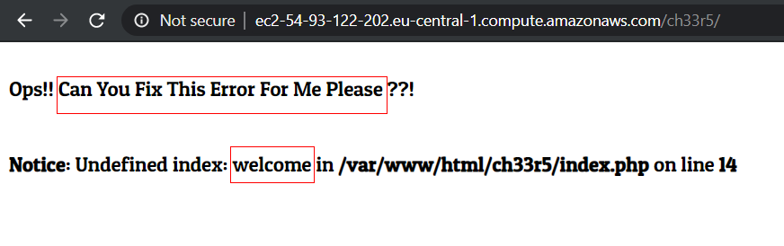
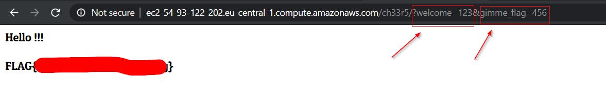

Thanks to my Friend [Abanob](https://www.facebook.com/Abanob.Medhaat) for teeling my that he is not welcome me 😅
===============

Challenge URL
===============
[Cheers](https://cybertalents.com/challenges/web/cheers)

Challenge Description
===============
Go search for what cheers you up

Level:
===============
easy

Points:
===============
50

Requirements: 
===============
you should have background about php or another backend language and error handling 

Tools:
===============
won't using any tools

___

From our hint you should search about shomething cheers you up mmmmm!
# steps:
1. From level of this challange we will Search in source code , open devtools, cookies, request and response from burp suite change request methods and Brute-Force directory you won't find anything.

2. so we should change our mind mmmm.

3. we should try to read our error.

4. we will notice that 

5. ask us to **fix error** in **index.php** file in **line 14**

6. but if you You are stupid like me, you won't notice that there are **parameter** in **line 14 called** **welcome**, not welcome you :(

7. try to add this parameter in **Url** and put any value ie: 123

8.  you will notice that there are **parameter** in **line 14 called** **gimme_flag**

9. try to add this parameter in **Url** and put any value ie: 456

10. the Flag: 

