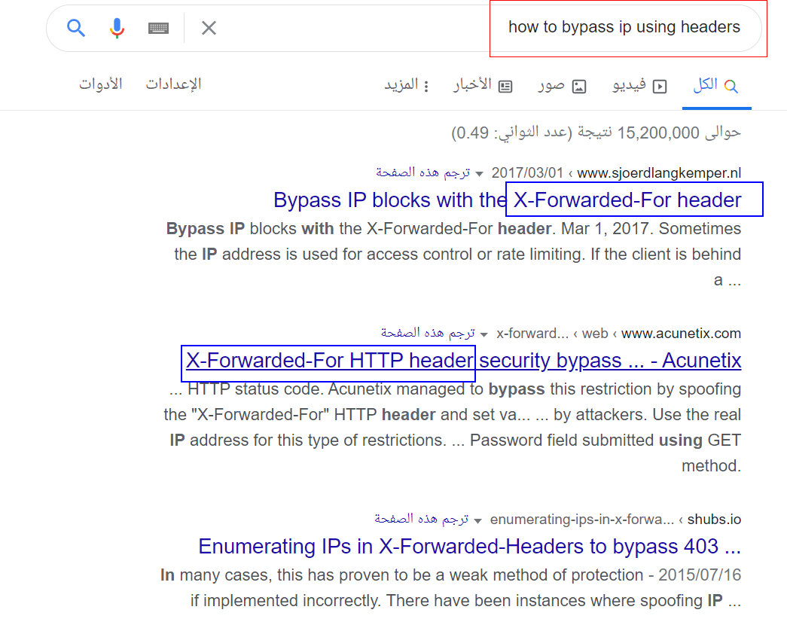
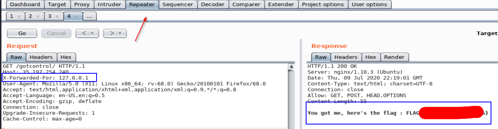

Challenge URL
===============
[Got Controls](https://cybertalents.com/challenges/web/got-controls)

Challenge Description
===============
We believe we made a good job protecting our infrastructure, can you bypass our controls.

Level:
===============
easy

Points:
===============
50

Requirements: 
===============
1. Knowledge about Headers and How to bypass IP headers 
2. Basics in Network 

Tools:
===============
1. Burp suite

___

From our hint you should search about How you can bypass **CONTROLS** (headers) and **infrastructure**
# steps:
1. open [challange](https://cybertalents.com/challenges/web/got-controls)

2. you shuould read this carefully **Sorry, your IP is not allowed, this server is only accessible from local machine or local LAN.**

3. after some time of thinking,You will conclude that you should bypass your IP to IP of local machine or local LAN as step.2

4. after some [search](https://whatismyipaddress.com/localhost) , you will discover that local machine or local LAN are localhost it's IP: 127.0.0.1

5.  

6. so we have an IP , so we need to bypass it after some search

7.  

8. let's use this **X-Forwarded-For** header with localhost ip **127.0.0.1** using burp inject this header and **assign** it to 127.0.0.1

9. Flag:  

