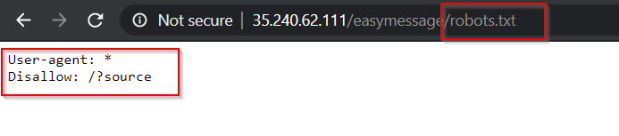

Challenge URL
===============
[Easy Message](https://cybertalents.com/challenges/web/easy-message )

Challenge Description
===============
I Have a Message for you

Level:
===============
easy

Points:
===============
50

Tools:
===============
1. burp suite
2. dirsearch
3. [decode.fr](https://www.dcode.fr/en)

___

So we should find This Message.

we should have a username and password to login.
# steps:

1. so we will search in *source code* , *cookies* , *use dev tools* for any username or password **we didn't find anything**

2. see Request and Response using burp suite **we didn't find anything**

3. try to detect sql injection vuln **there aren't any sql injection here**

4. so we will Brute forec directory using [dirsearch tool](https://github.com/maurosoria/dirsearch)

5. 

6. wow we found backup file and [robots file](https://moz.com/learn/seo/robotstxt)

7. open robots.txt

8. we found this directory 

9. 

10. open ?source directory

11. 

12. decode username and password using any online base64 dencoding tool or burp decoder

13. 

14. from the image above you will notice that username and password are the same so password and username = Cyber-Talent

15. finaly, when you login will have a message but are unabvious 

16. you should know this message are in morse-code format 

17. use [decode.fr](https://www.dcode.fr/en) to search about morse and translate it to clear text you can read it

18. copy & peaste your message like this image below 

19. the Flag : 

