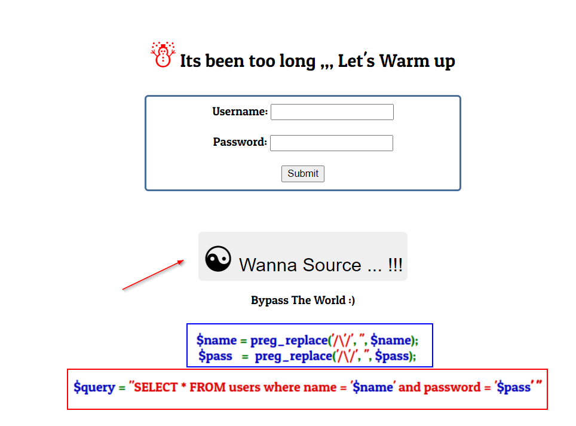
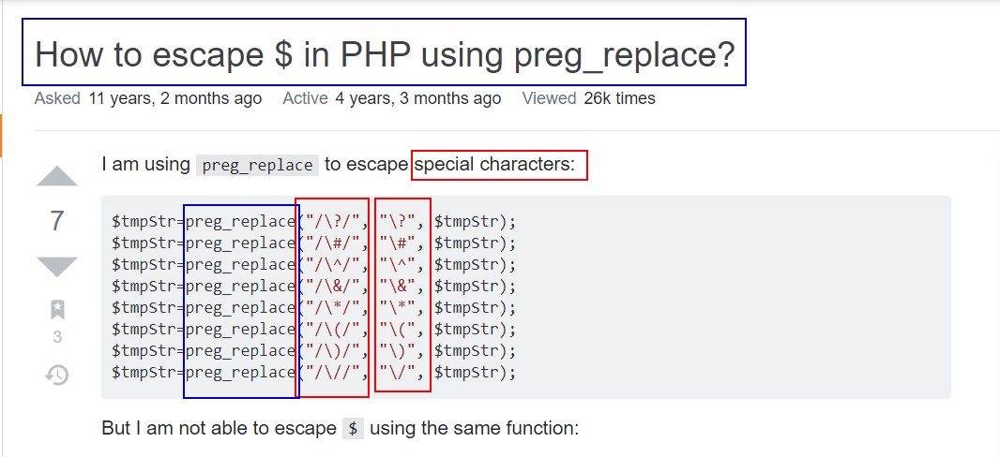
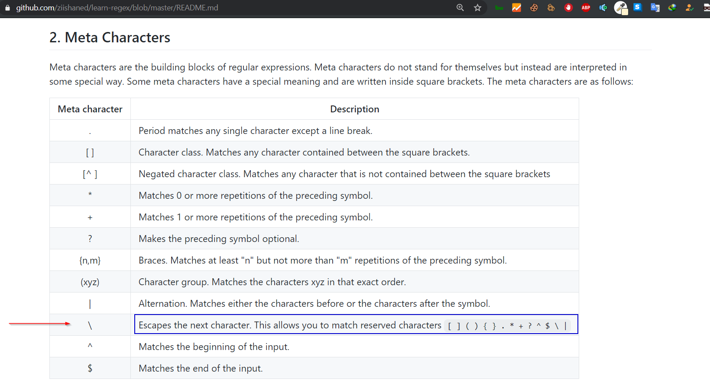
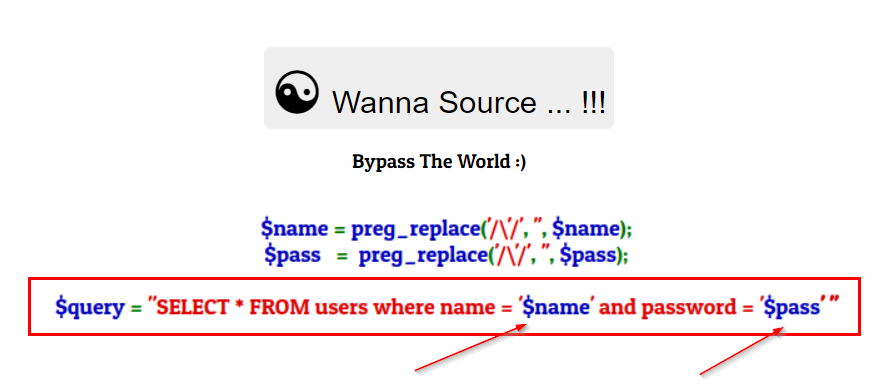
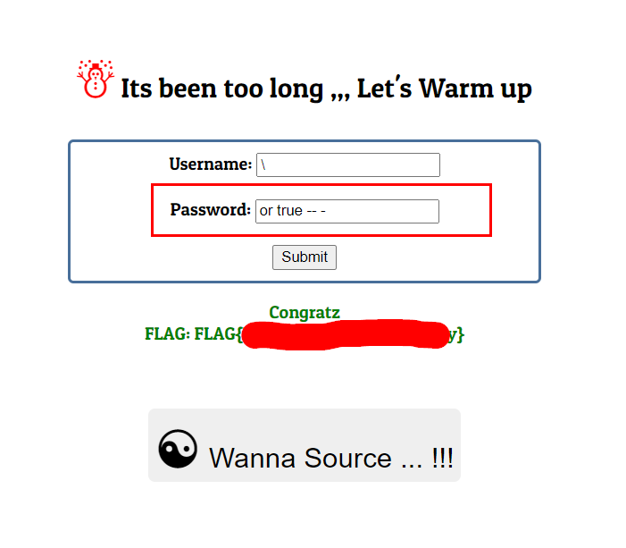
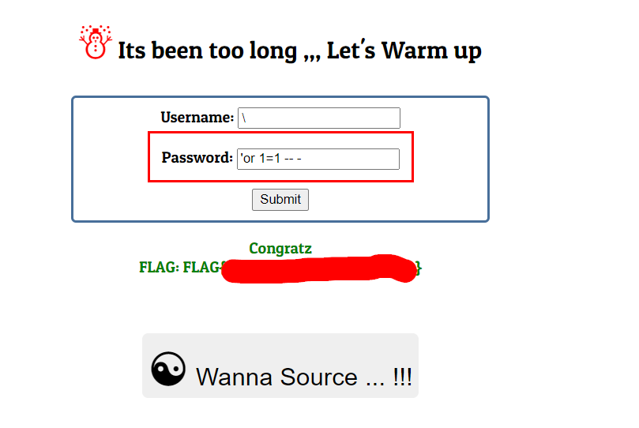

Thanks to : [Abdelrahman Adel (S99f)](https://twitter.com/K4r1it0)

Challenge URL
===============
[bypass the world](https://cybertalents.com/challenges/web/bypass-the-world)

Challenge Description
===============
I Don't Care if the world is against you, but i believe that you can bypass the world

Level:
===============
medium

Points:
===============
100

Requirements: 
===============
you should have background about:
1. php function [preg_replace escape](https://stackoverflow.com/questions/767714/how-to-escape-in-php-using-preg-replace) 
2. sql injection bypass techniques 
3. [Regex](https://github.com/ziishaned/learn-regex/blob/master/README.md)

Tools:
===============
won't using any tools

___

# steps:
1. From Challange when click on wanna source 

2. From first **Requirements link**, notice that it try to escape special character **single quote (') **

3. 

4. From third **Requirements link**,search about hot to escape next character, we will use **\\**

5. 

6. From step 1 will notice in this image there are a sql query to make you imagine this attack 

7. 

8. username parameter we 'll inject **\ backslash** to escape second single quote ' before **and**

9. so sql query will be like that: **$query ="SELECT * FROM users where name='\\' and password='$pass' "**

10. in this step i will explain step 9, sql query 'll be like that: $query ="SELECT * FROM users where name='and password='$pass' " **because backslash escape next single quote**

11. so in password parameter we should to achive sql injection by truthy to bypass this login form and get the flag

12. in password parameter 'll inject **or true -- - ,' or 1=1 -- -**

13. in this step i will explain step 12 **First payload**, sql query 'll be like that: $query ="SELECT * FROM users where name='and password='**or true -- -**'" *//true and will login*

14. in this step i will explain step 12 **Second payload**, sql query 'll be like that: $query ="SELECT * FROM users where name='and password='**' or 1=1 -- -**'" *//true and will login*

15. Falg with First payload:
  
16. Falg with Second payload:
  
