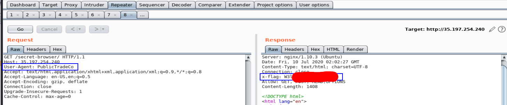
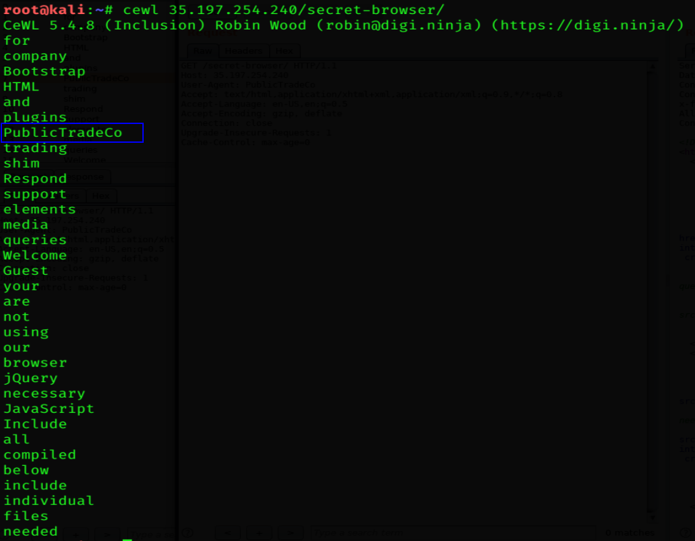
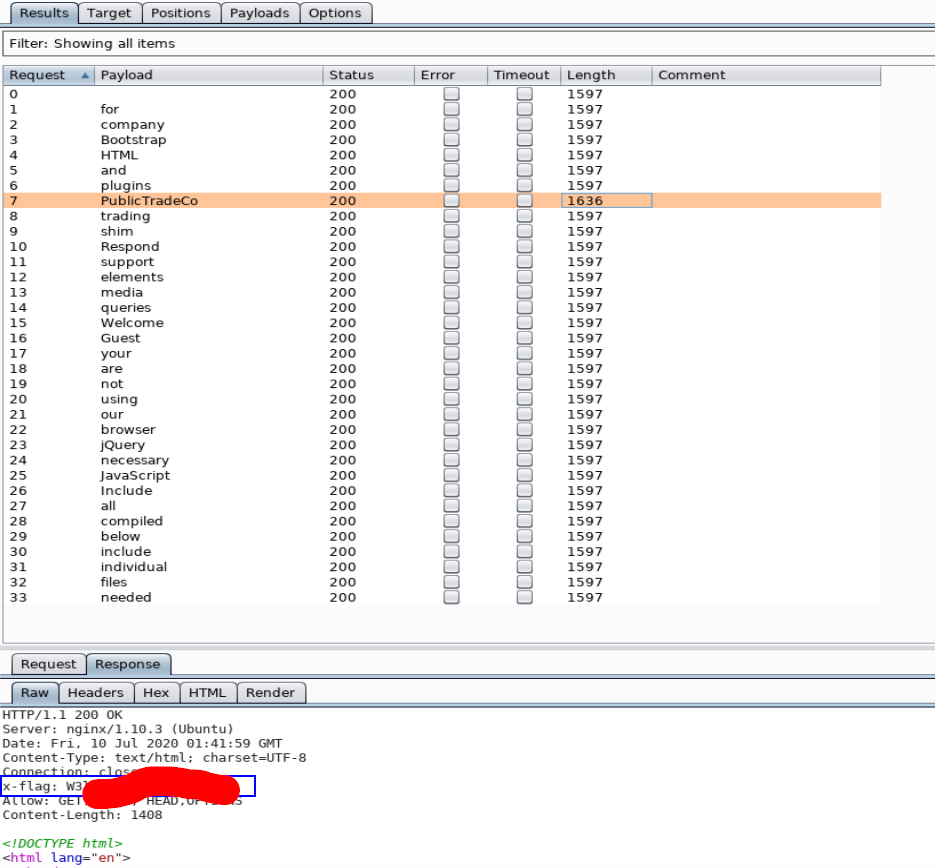

collaboration with [Mohamed Elawadly](https://twitter.com/Elawadly77)
===============

Challenge URL
===============
[Secret Browser](https://cybertalents.com/challenges/web/secret-browser)

Challenge Description
===============
The company employees is using company special browser to view the website content.

Level:
===============
medium

Points:
===============
100

Tools:
===============
1. [cewl](https://github.com/digininja/CeWL)
2. Burp suite
3. [User-Agent Switcher from Fire-Fox](https://addons.mozilla.org/en-GB/firefox/addon/user-agent-switcher-revived/?src=search)

___

From our hint we need to find **company special browser** [User-Agent](https://developer.mozilla.org/en-US/docs/Web/HTTP/Headers/User-Agent) 
# steps:

we will solve it with 2 ways: 

**First**

1. see source code 

2. notice the name of the company is: PublicTradeCo

3. open burp and switch User-Agent/ change User-Agent from [User-Agent Switcher from Fire-Fox](https://addons.mozilla.org/en-GB/firefox/addon/user-agent-switcher-revived/?src=search)  Header to: PublicTradeCo

4. Flag in response: 

**Second**

1. we will use [cewl](https://github.com/digininja/CeWL) which is CeWL is a Custom Word List Generator it have a mechanism like scraping from source code

2. 

3. we will work as we don't know that: PublicTradeCo is our company browser

4. we will copy these results and intrercept our page on burp and send it to intruder and set position to User-Agent calue  and peaste results of cewl in payloads  

4. Flag in response: 
