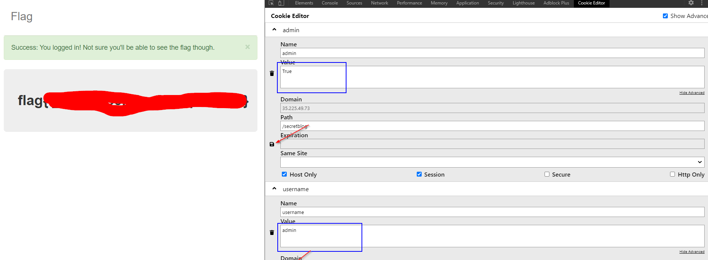

Challenge URL
===============
[Secret Blog](https://cybertalents.com/challenges/web/secret-blog)

Challenge Description
===============
Only Blog Admins can see the flag, could you be one of them?

Level:
===============
medium

Points:
===============
100

Requirements: 
===============
you should know about cookie manipulation and access control cases to vertical escalation(from user to admin)

Tools:
===============
[Cookie Editor extension on chrome](https://chrome.google.com/webstore/detail/cookie-editor/hlkenndednhfkekhgcdicdfddnkalmdm)
**OR**
[Cookie Editor extension on firefox](https://addons.mozilla.org/ar/firefox/addon/cookie-editor/)

___

from hint you need to be an admin 
# steps:
1. let's try Detect Sqli to login as an admin , but we didn't detect it 
2. let's see source code, dev tools, cookie
3. so we found two cookies admin and username 
4. try to manipulate cookies value
5. change username from **user** to **admin** and admin from **False** to **True**
6. Flag: 

